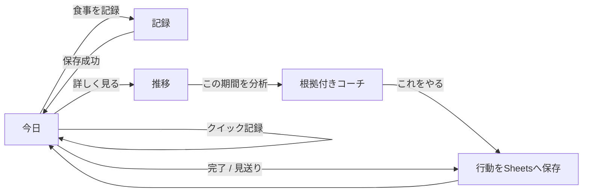
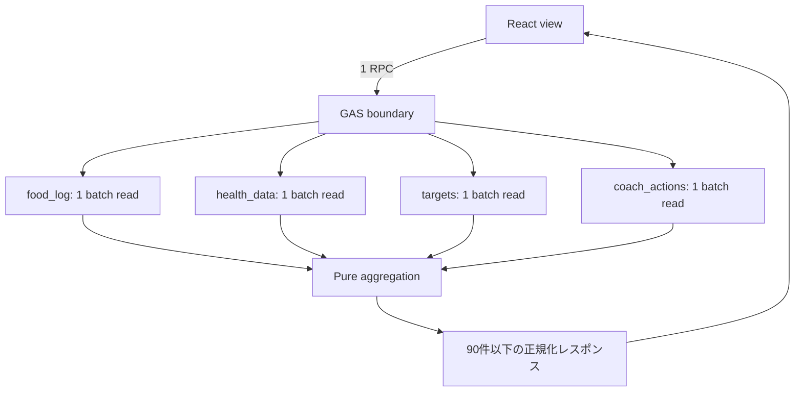

# diet-tracker 次期大型アップデート設計・実装計画

- 策定日: 2026-07-14
- 対象: 所有者本人向け GAS Web App
- 状態: 実装判断済み
- プロダクトテーマ: `記録 → 状態理解 → 次の行動 → 結果確認`

## 1. 結論

次期版の勝ち筋は、食品データベースや栄養素数で「あすけん」と競うことではない。本人の `food_log` と `health_data` を一つの時間軸で読み解き、データの確度を示したうえで、その日に実行できる一つの行動へつなげる。

実装する体験は次の3画面に固定する。

1. **今日**: 現在地、今日のフォーカス、進行中の行動、クイック記録
2. **記録**: 写真・テキストから最短で食事を保存する専用画面
3. **推移**: 体重、摂取・消費カロリー、PFC、歩数、記録カバレッジを同じ期間で確認する画面

AIを独立したチャット画面にはしない。「今日」と「推移」の文脈内で、サーバーが計算した根拠と行動候補から、優先すべき一つを選び、短く説明する役割に限定する。

## 2. 現状と解くべき問題

### 2.1 現行版の事実

- 今日のカロリー・PFC集計、目標、最近の記録、お気に入り、7日トレンド、日次・週次AIコメントは既に存在する。
- 7日トレンドは日別数値の一覧で、体重は単日の値だけを表示する。
- 日次AIは当日の食事名とPFC、週次AIは7日平均と目標差分を渡し、3文以内の汎用コメントを生成する。
- 390×844pxではページ全体が約2,900pxになり、記録、分析、設定が同じ視覚階層で縦に積み上がる。
- React画面は `src/main.tsx` 約70KB、GASバックエンドは `gas/Code.gs` 約34KBへ集中している。
- 生成済み単一HTMLは約208KB。グラフライブラリは未導入である。
- `getWeeklyTrend()` は期間内の食事と `health_data` の体重を読み取るが、歩数、消費カロリー、体脂肪率は返していない。

### 2.2 問題の定義

現行版の不足は「集計がない」ことではなく、次の3点である。

1. 記録と振り返りが一画面に混在し、主要操作が埋もれる。
2. 単日の数値と一覧だけでは、体重の日次変動と中期的な傾向を区別しにくい。
3. AIコメントがデータの十分さや根拠を示さず、実行した行動の追跡までつながらない。

### 2.3 既存Issueの扱い

| Issue | 次期版での位置付け |
|---|---|
| #35 Android向け写真入力 | フェーズAの入力基盤。撮影、縮小、撮り直し、削除を実装する |
| #36 保存不能理由 | フェーズAの入力基盤。操作順に沿う理由を1件表示する |
| #37 カード密度 | フェーズAの画面階層。記録を主、分析・設定を従にする |
| #47 12MP画像のデコード失敗 | #35と同時実装し、別Issueとして実機受け入れ条件を満たす |

## 3. 調査結果とプロダクト原則

### 3.1 競合から採用する考え方

| 対象 | 強み | 採用する要素 | 採用しない要素 |
|---|---|---|---|
| あすけん | 豊富な食品検索、栄養グラフ、体重・活動連携、毎日の助言 | 記録直後のフィードバック、目標との比較 | 食品DBや栄養素数の追随 |
| MacroFactor | 生の体重とトレンド体重の分離、データ不足状態の明示、期間比較 | 体重ノイズの平滑化、記録カバレッジ、判断保留 | 非公開アルゴリズムの模倣や自動カロリー処方 |
| Oura Advisor | 長期傾向を文脈にした任意利用のAI、非医療の境界、ユーザー制御 | オンデマンド分析、根拠付き説明、AIなしでも成立するUI | 会話履歴・記憶を中心にしたチャット |
| Noom | 結果だけでなく行動と理由を扱う | 一つの小さな行動、完了の振り返り | 教材、コミュニティ、医療サービス |

あすけんは2026年時点で、画像・バーコード・検索による記録、体重・歩数等のHealth Connect連携、栄養グラフ、AI献立提案の個別化まで提供している。このため、グラフや生成AIの存在自体は差別化にならない。

### 3.2 行動変容研究からの判断

- デジタルな食事・体重のセルフモニタリングは減量支援と関連する一方、継続率が課題になる。したがって入力摩擦を増やす分析機能は採用しない。
- フィードバックは、単なる評価より、目標、セルフモニタリング、具体的な行動計画と組み合わせる。
- JITAIの考え方は、状況、介入判断、介入候補を明示する点だけを採用する。既存不変条件によりバックグラウンド通知や自動AI実行は行わず、ユーザーが画面を開いた文脈で提示する。
- 体重は日次値に反応させず、複数日の傾向を主要表示にする。生の値は隠さず、傾向線と併記する。

### 3.3 プロダクト原則

1. **記録が常に最短**: 分析機能追加後も、写真選択後の保存までを30秒以内で完了できる。
2. **一度に一つのフォーカス**: AIもルールも、最優先の行動を一つ選ぶ。
3. **事実と解釈を分離**: 数値、期間、確度を先に計算し、AIは説明だけを担当する。
4. **欠測をゼロにしない**: 未記録、未計測は `—` として扱い、0としてグラフや平均へ混ぜない。
5. **日次ノイズで罰しない**: 体重の主要指標は7日移動平均とし、単日増減を失敗扱いしない。
6. **AIなしでも完結**: AI障害・安全上限到達時も、集計、根拠、ルール由来の行動候補を表示する。
7. **本人のSheets内で閉じる**: 新しい永続データは既存Spreadsheet内だけに保存する。

## 4. 成功指標

### 4.1 体験指標

| 指標 | 合格条件 | 測定方法 |
|---|---|---|
| 写真記録時間 | 写真選択後から保存完了まで中央値30秒以内 | Android Chromeで5回計測 |
| クイック記録時間 | お気に入り選択から保存完了まで5秒以内 | Android Chromeで5回計測 |
| 主要導線 | 390×844pxの初期表示内で「現在地」と「記録」CTAが見える | 画面確認 |
| 保存不能時 | 次に必要な操作が1件だけ表示される | API/手動両モード確認 |
| AIの具体性 | すべての提案に根拠、観測期間、確度、実行可能な行動がある | 契約テスト |

### 4.2 継続・行動指標

本番分析用の新しいイベントログは作らない。既存データと `coach_actions` から算出する。

- `logging_day_rate`: 期間中、食事が1件以上ある日の割合
- `adequate_coverage_rate`: 朝・昼・夜のうち2種類以上が記録された日の割合
- `weight_measurement_rate`: 期間中、体重がある日の割合
- `coach_action_completion_rate`: 完了した行動数 / 承認した行動数

`coach_action_completion_rate` は行動の承認・完了を実装するフェーズDの公開後から測定する。

リリース前28日をベースライン、リリース後15〜42日を比較期間とし、次を目標とする。

- `logging_day_rate` を悪化させない。
- `adequate_coverage_rate` を10ポイント改善するか、80%へ到達する。
- 承認したコーチ行動の50%以上を完了できる。

体重そのものは短期間のプロダクト合否に使わない。体重目標への変化は本人の健康状態や観測期間の影響を受けるため、推移確認の参考指標とする。

## 5. 情報設計と主要フロー

### 5.1 採用案

単一の縦長ページ、4タブの独立AIコーチ、3画面＋文脈内コーチを比較し、3画面案を採用する。

- 下部ナビゲーション: `今日 / 記録 / 推移`
- 設定: ヘッダー右上から全画面シートとして開く
- AIステータス: 設定内へ移し、起動時には読み込まない
- 新しいブラウザセッションは「今日」から開始する
- 同一セッション内では選択画面を `sessionStorage` に保持する
- 記録成功後は「今日」へ戻り、保存結果と現在地を更新する
- 「記録」画面では通常の下部ナビを固定保存バーへ置き換え、誤移動を防ぐ



### 5.2 「今日」画面

初期表示内の順序を固定する。

1. 日付、データ更新状態、設定
2. 進行中のコーチ行動。なければルール由来の「今日のフォーカス」
3. カロリーとPFCのコンパクトな進捗
4. 主CTA「食事を記録」
5. 最近・お気に入りからのクイック記録
6. 今日の食事一覧と編集

集計取得に失敗しても「記録」への導線は常に利用できる。

### 5.3 「記録」画面

- 現行の写真・テキスト、API・手動、品目補正、編集を維持する。
- 最近の記録とお気に入りはフォームの下部ではなく、入力前のクイック候補として統合する。
- #35/#47の画像処理、#36の保存案内を先に完了する。
- 下部固定領域には保存ボタンと、保存不能理由を1件だけ表示する。
- 戻る操作ではドラフトを保持し、ユーザーが明示的に「入力を破棄」した場合だけ削除する。

### 5.4 「推移」画面

- 期間は `7日 / 30日 / 90日`。初期値は30日。
- すべてのチャートは同じ期間と選択日を共有する。
- 画面上部に記録カバレッジとデータ確度を表示する。
- 「この期間をAIで分析」はユーザー押下時だけ実行する。
- AI結果はチャートの下ではなく、根拠と隣接する要約領域へ表示する。

## 6. グラフ仕様

外部チャートライブラリは追加せず、ReactコンポーネントとしてSVGを実装する。現在約208KBの単一HTMLを300KB未満に保ち、GAS Web Appの起動コストを抑える。

### 6.1 共通仕様

- SVG、軸、凡例、選択日の詳細パネルを共通コンポーネント化する。
- 色だけで系列を区別せず、線種、点、ラベルを併用する。
- グラフには短いテキスト要約と、開閉可能なデータ表を付ける。
- `<svg role="img">` にタイトルと説明を関連付ける。
- 日付詳細はグラフ上の小さい点だけに依存せず、44pxの前日・翌日ボタンとネイティブ日付選択を提供する。
- 欠測値は線で無条件につながず、`—` として詳細表示する。
- 期間変更と日付選択はAIを呼び出さない。

### 6.2 体重

- 生の体重: 淡い点
- 主要線: 過去7暦日の測定値平均。窓内に3件以上ある日だけ算出
- 目標体重: 設定済みの場合だけ水平線
- 要約: 最新トレンド体重、表示期間の最初と最後の差
- 比較期間が7日未満、または有効なトレンド点が2件未満なら差を表示しない
- 生の欠測値は補間しない

### 6.3 摂取・消費エネルギー

- 摂取カロリー: 日別棒
- `health_data.total_calories_kcal`: 同一kcal軸の線
- 摂取目標: 水平線
- エネルギー差分は、当日の記録カバレッジが2/3以上かつ消費データがある場合だけ計算する
- 記録が不十分な日は「不足」ではなく「判定保留」と表示する

### 6.4 PFC

- P/F/Cを同時に重ねず、セグメントで1系列を選ぶ
- 値は各日の目標比率 `実績 / 目標 × 100` とし、100%を基準線にする
- 目標未設定の場合はグラム表示へ切り替え、目標比や過不足を出さない
- 初期選択はタンパク質とする

### 6.5 歩数と記録カバレッジ

- 歩数は日別棒と7日平均を表示する。歩数目標は次期版では追加せず、平均との比較に留める。
- 記録カバレッジは朝・昼・夜の記録種類数を0/3〜3/3で表示し、間食は比率へ含めない。
- カバレッジは「実際に食べた全量」ではなく「記録の十分さの近似」であることを明記する。

## 7. 集計と確度の定義

### 7.1 日別集計

- 日付境界は `Asia/Tokyo`。
- `food_log` は期間内の全行を日付単位で合計する。
- 同一日の複数食はすべて合計し、食事タイプは集合として保持する。
- `health_data` に同一日が複数ある場合、下側の行の非空値が項目単位で優先される。
- 空文字、非数、範囲外の体重は `null`。
- `null` は平均、合計、差分の分母に含めない。

### 7.2 記録カバレッジ

```text
coverage_ratio = unique(朝, 昼, 夜の記録済みタイプ数) / 3
adequate = coverage_ratio >= 2 / 3
```

間食だけの日は記録日には含めるが、栄養・エネルギー分析では低確度とする。

### 7.3 データ確度

| データ | high | medium | low |
|---|---|---|---|
| 栄養 | 期間の70%以上が adequate | 40〜69% | 40%未満 |
| 体重 | 平均3回/7日以上 | 平均1回/7日以上 | それ未満 |
| 活動 | 期間の70%以上に歩数または消費がある | 40〜69% | 40%未満 |

複数データを使う示唆の総合確度は、必要データのうち最も低い確度とする。

## 8. AIコーチ仕様

### 8.1 役割分担

サーバーの純粋関数が次を決定する。

- 集計値と欠測
- データ確度
- 根拠候補
- 優先度
- 実行可能な行動候補と、その中で使える数値

AIへ渡すリクエストはGASが構築し、次のデータだけに限定する。

- 観測期間とデータ確度
- サーバーが計算した、カロリー・PFCの実績、平均、目標差
- サーバーが計算した、体重トレンドと期間差、歩数平均、記録カバレッジ
- 当日または選択期間内の食事名（`food_log.description`）と `meal_type`
- `evidence_key` と `action_key` の候補、および各候補の根拠となる集計数値

画像（カロリー推定リクエストを除く）、生のSheet行、`breakdown_json` 全文、秘密、Spreadsheet ID、deployment情報は送らない。

サーバーは優先度順に最大3組の `evidence_key` / `action_key` 候補を提示し、AIはその中から1組だけを選択する。AIは集計数値と食事名を、優先順位の選択と具体的な説明のために参照できる。AIは次だけを返す。

- 40文字以内の見出し
- 160文字以内の説明
- サーバーが提示した `action_key` の選択
- サーバーが提示した `evidence_key` の選択

初期実装ではAIの説明に数字文字（`0-9`、`０-９`）を含めない。UIに表示する数値根拠と行動文は、応答後にGASが検証済みデータとサーバーテンプレートから再結合する。AIに診断、食事制限量、行動文を生成させない。数値をAI説明へ含める拡張は本計画に含めず、根拠数値との一致検証を設計する別Issueで扱う。

返却キーが未選択または提示候補に存在しない、キーの組み合わせが提示した組と一致しない、または説明に数字が含まれる場合はAI応答を破棄し、サーバー優先度1位の候補をルール由来の結果として採用する。候補がない場合はAIを呼ばず、ルール結果だけを返す。

### 8.2 示唆の種類と優先順位

1. **data_quality**: 記録不足で判断できない。AIを呼ばず、次に必要な記録を提示
2. **today_next_meal**: 当日の残り目標から、次の一食で優先するPFCを提示
3. **weight_trend**: 14日以上の体重傾向を、栄養・活動の確度付きで説明
4. **energy_pattern**: adequate日の摂取・消費傾向を説明
5. **protein**: タンパク質目標比の継続的不足を説明
6. **activity**: 歩数平均の本人内比較を説明
7. **progress**: 目標へ近づいた行動を具体的に承認

同時に複数条件を満たしても、画面の主要フォーカスは1件とする。代替行動は最大1件まで表示する。

### 8.3 行動候補

行動はサーバーテンプレートから生成する。

- `logging`: 明日は朝・昼・夜のうち2食以上を記録する
- `energy`: 目標と当日実績から残りが正数の場合だけ「次の一食を選ぶ前に残り○kcalを確認する」を提示する
- `protein`: 次の一食にタンパク質源を1品追加する
- `macro_balance`: 次の一食で現在最も不足するP/F/Cを優先する
- `activity`: 歩数が直近7日のうち5日以上ある場合だけ、`min(7日平均+1,000歩, 7日最高値)` を明日の目安として提示する

数値条件を満たせない場合、その候補自体を生成しない。

### 8.4 安全境界

- 医療診断、疾患リスク判定、投薬変更、極端な摂取制限を生成しない。
- 体重変化の原因は断定せず「関連する可能性」「データ上は判断できない」と表現する。
- ユーザー目標をAIが変更しない。
- 低確度時は改善評価より記録行動を優先する。
- AI呼び出しは `google.script.run` からの明示的なボタン操作だけにする。
- AIへ送るデータは、サーバーが計算した集計数値・食事名・傾向/確度キーに限定する。画像（カロリー推定を除く）、生のSheet行、秘密、Spreadsheet構成情報は送らない。新しいデータ種別を送信対象へ追加する場合は、実装前に所有者の承認を都度得る（`DATA_SHEETS_ONLY` 改訂版に従う）。
- 既存のOpenAI資格確認、公開ルール鮮度、token予約・安全上限を必ず通す。
- AI失敗時はルール結果を返し、記録やグラフをブロックしない。
- 会話履歴、AIメモリ、プロンプト全文は保存しない。

## 9. 公開APIとTypeScript型

### 9.1 新規・置換API

```ts
type DashboardRangeDays = 7 | 30 | 90;
type DataConfidence = 'low' | 'medium' | 'high';
type CoachScope = 'today' | 'trend';
type CoachActionStatus = 'planned' | 'completed' | 'dismissed' | 'expired';
type CoachActionCategory = 'logging' | 'energy' | 'protein' | 'macro_balance' | 'activity';

type HealthGoals = NutritionTargets & {
  target_weight_kg: number | null;
};

type MealCoverage = {
  logged_main_meal_types: Array<'朝' | '昼' | '夜'>;
  ratio: number;
  adequate: boolean;
};

type DashboardDay = {
  date: string;
  intake: NutritionTotal;
  meal_count: number;
  coverage: MealCoverage;
  weight_kg: number | null;
  weight_trend_kg: number | null;
  body_fat_pct: number | null;
  steps: number | null;
  expenditure_kcal: number | null;
  energy_balance_kcal: number | null;
};

type DashboardData = {
  range_days: DashboardRangeDays;
  window_start: string;
  window_end: string;
  goals: HealthGoals;
  confidence: {
    nutrition: DataConfidence;
    weight: DataConfidence;
    activity: DataConfidence;
  };
  summary: {
    logging_days: number;
    adequate_days: number;
    recording_coverage_ratio: number;
    average_intake_kcal: number | null;
    average_protein_g: number | null;
    average_steps: number | null;
    latest_weight_trend_kg: number | null;
    weight_change_kg: number | null;
  };
  days: DashboardDay[];
};

type CoachEvidence = {
  key: string;
  label: string;
  value: number;
  unit: 'kcal' | 'g' | 'kg' | 'steps' | '%' | 'days';
  comparison_value: number | null;
  comparison_label: string | null;
  period_start: string;
  period_end: string;
  confidence: DataConfidence;
};

type CoachActionCandidate = {
  key: string;
  category: CoachActionCategory;
  text: string;
  target_date: string;
};

type CoachInsight = {
  generated_at: string;
  scope: CoachScope;
  source: 'ai' | 'rules';
  headline: string;
  summary: string;
  confidence: DataConfidence;
  evidence: CoachEvidence[];
  selected_action: CoachActionCandidate | null;
  alternative_action: CoachActionCandidate | null;
  fallback_notice?: string;
};

type CoachAction = CoachActionCandidate & {
  id: string;
  created_at: string;
  status: CoachActionStatus;
  completed_at: string | null;
};

type HomeSnapshot = {
  date: string;
  today: TodaySummary;
  goals: HealthGoals;
  today_meals: SavedMeal[];
  recent_meals: SavedMeal[];
  favorites: FavoriteMeal[];
  active_action: CoachAction | null;
  rule_focus: CoachInsight;
};
```

GAS境界へ追加する関数は次で固定する。

```ts
getHomeSnapshot(): Promise<HomeSnapshot>
getDashboardData(rangeDays: DashboardRangeDays): Promise<DashboardData>
getGoals(): Promise<HealthGoals>
saveGoals(goals: HealthGoals): Promise<{ ok: true; goals: HealthGoals }>
generateCoachInsight(request: {
  scope: CoachScope;
  range_days?: DashboardRangeDays;
}): Promise<CoachInsight>
acceptCoachAction(payload: {
  scope: CoachScope;
  range_days?: DashboardRangeDays;
  action_key: string;
}): Promise<CoachAction>
setCoachActionStatus(
  id: string,
  status: 'completed' | 'dismissed',
): Promise<CoachAction>
```

### 9.2 互換性

- `food_log` と `health_data` の既存列は変更しない。
- `getTargets()` / `saveTargets()` は当面残し、新しい `getGoals()` / `saveGoals()` の栄養部分へ委譲する。
- `getWeeklyTrend()`、日次・週次コメントAPI、`weekly_review` はAIコーチ移行後1リリース残す。
- 新UIが安定した次の保守リリースで、未使用APIの削除を別Issueにする。
- GASのnullableプロパティ欠落に備え、`gasClient.ts` で全 `number | null`、文字列、配列を境界正規化する。

## 10. Sheetsスキーマ

### 10.1 `targets`

既存のkey-value構造へ次を追加する。

| key | value |
|---|---|
| `target_weight_kg` | 20〜300の数値または未設定 |

既存4キーは変更しない。`saveGoals()` は5項目をまとめて検証してから一括更新する。
各値は `null` による未設定・解除を許可し、数値の場合だけ非負・上限・有限値を検証する。

### 10.2 `coach_actions`

| 列 | 名前 | 型 |
|---|---|---|
| A | id | `action_` + UUID |
| B | created_at | ISO 8601 |
| C | target_date | YYYY-MM-DD |
| D | category | 許可された5カテゴリ |
| E | action_key | 最大64文字 |
| F | text | 最大200文字 |
| G | status | planned / completed / dismissed |
| H | completed_at | ISO 8601または空 |
| I | evidence_json | 最大5,000文字の根拠スナップショット |

- 初回アクセス時にヘッダーを作成する。
- 書き込み前に全項目をサーバー検証する。
- `target_date` は受付日から7日以内に限定する。
- `acceptCoachAction()` はclientから受け取った文言や根拠を保存せず、`scope`、`range_days`、`action_key` からサーバー側で候補と根拠を再計算する。候補が再現できなければ保存せず、画面更新を求める。
- 同一 `target_date` のplanned行は1件だけにし、新しい行動を承認した場合は既存行をdismissedへ更新する。
- 作成・状態更新はScript Lock内で検索と書き込みを行う。
- `target_date` が過ぎたplanned行はレスポンス上だけ `expired` として扱い、自動トリガーや読取API内の書き込みは行わない。
- AIの説明、会話、プロンプトは保存しない。

## 11. データフローと性能設計

### 11.1 読み込み



- 「今日」の起動時は `getHomeSnapshot()` だけを呼ぶ。
- `getHomeSnapshot()` は当日食事を全件、最近の記録を3件、お気に入りを更新日時順で最大6件返す。
- 「推移」は初めて開いたときに30日を遅延取得する。
- 7/30/90日の取得結果はReactメモリ内だけに保持する。
- 食事の保存・更新・削除、目標変更後にクライアントキャッシュを破棄する。
- 個人データをCacheService、PropertiesService、外部ストレージへ保存しない。
- 1 API内で各Sheetを最大1回 `getValues()` し、メモリ上で集計する。
- `getDashboardData()` は生の食事行を返さず、最大90日の日別集計だけを返す。

### 11.2 実装分割

- 日付、欠測、移動平均、確度、要約は副作用のない `DashboardMetrics` ロジックへ分離し、Nodeテスト可能にする。
- 根拠抽出、優先順位、行動候補は副作用のない `CoachRules` ロジックへ分離する。
- Sheets読取・書込とAI呼出だけを `Code.gs` / `OpenAiProvider.gs` の境界へ残す。
- ReactはApp shell、3 views、charts、coach、settingsへ分割し、`main.tsx` は起動処理だけにする。

### 11.3 性能合格条件

- 開発用Spreadsheetで `food_log` 10,000行、`health_data` 5,000行を用意して検証する。本番Sheetへテストデータを入れない。
- `getDashboardData(90)` を10回実行し、中央値2秒未満、最大4秒未満。
- JSONレスポンスは150KB未満。
- 純粋集計はNode上で10,000＋5,000行を100ms未満。
- `gas/index.html` は非圧縮300KB未満。
- 上限を超えた場合だけ、日次集計Sheetの導入を別設計として検討する。次期版の初期実装には追加しない。

Google Apps Scriptは1実行6分の上限があり、サービス呼び出しを減らすバッチ処理が推奨される。上記設計ではRPCとSheet読取回数を減らし、集計をJavaScriptメモリ上で行う。

## 12. エラー・欠測・境界ケース

- 目標未設定: 過不足を出さず、設定CTAを表示する。
- 食事0件: 0kcalは表示できるが、栄養評価は「データなし」とする。
- 間食のみ: logging dayだがnutrition confidenceはlow。
- 未来日時の食事: 今日・推移の集計から除外する。既存の編集では保持する。
- 体重1件: 生値だけ表示し、トレンドと差分は非表示。
- 連続欠測: 線をまたいで接続しない。
- health_data重複日: 下側の非空値を採用する。
- 消費カロリーなし: エネルギー差分を計算しない。
- AI利用不可: ルール結果とfallback noticeを表示する。
- 不正AI JSON / 未知のキー: 応答を採用せずルール結果へ戻す。
- Dashboard失敗: 再試行を表示し、「記録」画面は利用可能にする。
- action更新競合: Script Lock失敗時は書き込まず、再試行可能なエラーを返す。

## 13. 実装ロードマップ

優先度は `健康・減量への寄与30% + 継続25% + 確信度20% + 安全性15% + 実装容易性10%` で評価した。

| 候補 | スコア | 判断 |
|---|---:|---|
| 入力信頼性と保存案内 | 4.30 | 最初に実装 |
| 体重・栄養・活動トレンド | 4.30 | 中核機能 |
| 根拠付きコーチと行動追跡 | 4.25 | 中核機能 |
| 3画面の情報設計 | 4.05 | 中核機能の前提 |
| 栄養素を14種類以上へ拡張 | 2.50 | 非スコープ |
| 自由入力AIチャット | 2.30 | 非スコープ |

実行順は **フェーズA → フェーズC → フェーズB → フェーズD → フェーズE** とする。

- フェーズCはフェーズAのApp shellに依存するが、フェーズBには依存しない。
- フェーズCでは、6.2の目標体重線を「目標未設定」状態でリリースする。フェーズBで `target_weight_kg` を追加した後に目標線を有効化する。
- 推移画面の「この期間をAIで分析」ボタンは、フェーズDの公開まで非表示にする。
- `coach_action_completion_rate` はフェーズDの公開後から測定する。

### フェーズA: 入力基盤とApp shell（M、3 PR）

1. #35/#47: 画像の背面カメラ指定、軽量寸法読取、アスペクト比を保つ縮小、`createImageBitmap`失敗時の``フォールバック、日本語エラー、撮り直し・削除。
2. #36/#37: 保存不能理由、aria-live、視覚階層、フォーカス、reduced motion、44px、Lighthouse。
3. ReactをApp shellと画面単位へ分割し、`今日 / 記録 / 推移` ナビを追加する。機能は現行と同等のまま移す。

完了条件: 既存機能が3画面で利用でき、Android写真記録と編集・手動入力に退行がない。

### フェーズB: 今日の行動ループ（M、2 PR）

1. `target_weight_kg`、`getGoals/saveGoals`、`getHomeSnapshot` を追加する。
2. 今日画面、クイック記録、ルール由来フォーカス、保存後のToday復帰を実装する。

完了条件: 初期表示内で現在地と記録CTAが分かり、AIなしで今日の次の操作を判断できる。

### フェーズC: グラフィカルな推移（L、3 PR）

1. `DashboardMetrics` と純粋テストを追加する。
2. `getDashboardData(7|30|90)` とclient境界正規化を追加する。
3. 体重、エネルギー、PFC、歩数、カバレッジのSVGチャート、要約、データ表を追加する。

完了条件: 欠測を誤表現せず、同じ期間で体重・食事・活動を確認できる。

### フェーズD: 根拠付きAIコーチ（L、3 PR）

1. `CoachRules`、根拠、確度、候補行動、AI応答バリデーションを実装する。
2. `generateCoachInsight()` を既存AIプロバイダー境界へ追加し、ユーザー操作時だけ呼ぶ。
3. `coach_actions`、承認、完了、見送り、今日画面の進行中行動を実装する。

完了条件: AIが未知の事実や行動を追加できず、AI障害時も同じ操作をルール結果で完了できる。

### フェーズE: 検証と段階リリース（S、1〜2 PR）

1. 性能、アクセシビリティ、Android実機、GAS dev deploymentで検証する。
2. docs、セットアップ、スキーマ、不変条件参照を更新する。
3. 本人確認後に既存deploymentを更新する。旧APIは1リリース保持する。

## 14. テスト計画

### 14.1 純粋ロジック

- JSTの日付境界、夏時間に依存しない期間生成
- 7/30/90日の開始・終了
- 食事タイプ重複とcoverage ratio
- 間食のみ、未来食事、欠測
- 体重の7日平均、窓内3件未満、範囲外値
- health_data同日重複と非空優先
- adequate日のみのenergy balance
- high/medium/low確度境界
- 根拠の優先順位と候補行動生成
- AIの未知evidence/action key拒否
- AI応答の選択キーがサーバー提示候補（優先度上位3件）の範囲外の場合に、サーバー優先度1位へフォールバックする
- coach action payloadの長さ、enum、日付、状態遷移

### 14.2 GAS・client境界

- `google.script.run` がnullプロパティを落としても、clientでnullへ正規化する。
- Sheet未作成時にヘッダーを作成する。
- 既存targetsだけのSheetからHealthGoalsを読み取れる。
- `food_log`、`health_data`、`weekly_review`を変更せずに新APIが動く。
- 新しい書き込みAPIがサーバーバリデーション後だけ書き込む。
- AI呼び出しがOpenAIの全安全ガードを通る。
- 時間主導・onOpen・onEditトリガーからAIへ到達しない。

### 14.3 UI・アクセシビリティ

- 360/390/412px幅、Android Chromeで横スクロールなし。
- すべての操作対象44×44px以上。
- キーボードだけでナビ、期間、日付、設定、保存、行動更新が可能。
- フォーカス表示、aria-live、loading/error/emptyを確認。
- 色覚に依存せず系列、目標超過、欠測を判別できる。
- `prefers-reduced-motion` で不要なアニメーションを停止する。
- グラフとテキスト要約・データ表の内容が一致する。
- Lighthouse Performance / Accessibility / Best Practices / SEOを各90以上。

### 14.4 主要シナリオ

1. 写真撮影 → 推定 → 品目補正 → 保存 → 今日更新
2. 12MP JPEG → 縮小またはフォールバック → 成功/日本語案内
3. お気に入り → ワンタップ保存 → 取り消し
4. 目標未設定 → Today/Trendsで設定CTA
5. 体重3件未満 → 生値だけ、トレンド非表示
6. 低カバレッジ → AI分析より記録改善を優先
7. 30日推移 → 期間変更 → 日付詳細 → 表表示
8. AI分析 → 行動承認 → Today表示 → 完了
9. AI上限到達/障害 → ルール結果で継続
10. 食事編集・削除 → client cache破棄 → 再集計

## 15. 不変条件チェック

各フェーズで `docs/invariants.yml` を正本として確認する。

- `SECRET_IN_SCRIPT_PROPERTIES`: 秘密を新API、ログ、AI根拠へ含めない。
- `DATA_SHEETS_ONLY`: 永続化先は既存Spreadsheetだけとし、client/server cacheへ個人データを永続化しない。ユーザー操作起点のAI機能では、食事名・食事タイプ・栄養/健康の集計数値だけを承認済みGemini/OpenAI推論エンドポイントへ送信できる。新しい送信先・データ種別は実装前に所有者の明示承認を得る。
- `IMAGE_NOT_PERSISTED`: 画像は推定リクエスト内だけ。
- `GEMINI_USER_INITIATED_ONLY`: コーチAIはボタン操作時だけ。
- `GEMINI_API_BOUNDARY`: AIと秘密はGAS側だけ。
- `OPENAI_BUDGET_GATE_NOT_BYPASSABLE` / `OPENAI_USAGE_LOCK_SAFE`: 既存ガードを再利用する。
- `SERVER_SIDE_WRITE_VALIDATION`: goalsとcoach_actionsもサーバー検証する。
- `WEBAPP_ACCESS_SCOPE`: MYSELF / USER_DEPLOYINGを維持する。
- `SCHEMA_CONTRACT`: targets追加、coach_actions新設、互換方針をdocsへ反映する。
- `GAS_NULLABLE_BOUNDARY`: 新しいnullableをclient境界で正規化する。

## 16. 非スコープ

- 一般公開、複数ユーザー、アカウント管理
- 外部ホスティング、専用DB、分析SDK
- 14種類以上の栄養素・食品検索DB・バーコード
- AIチャット、会話履歴、長期メモリ、自動通知
- 医療診断、治療、薬、疾患別の食事指導
- 睡眠・血圧の新規取込
- 自動的な摂取目標変更、推定TDEEアルゴリズム
- Looker Studioの即時廃止。次期版検証後に利用状況を見て判断する

## 17. 参照資料

### 競合・プロダクト

- [あすけん公式アプリ機能](https://www.asken.jp/ad/73308185)
- [あすけん 2026年プレミアム機能拡充](https://more.asken.jp/article/25900/)
- [MacroFactor Weight Trend](https://help.macrofactorapp.com/dashboard/weight_trend)
- [MacroFactor Dashboard](https://help.macrofactorapp.com/dashboard/consistency/)
- [Oura Advisor](https://support.ouraring.com/hc/en-us/articles/39512345699219-Oura-Advisor)
- [Noom](https://www.noom.com/)

### 行動変容・セルフモニタリング

- [Self-Monitoring via Digital Health in Weight Loss Interventions](https://pmc.ncbi.nlm.nih.gov/articles/PMC12838191/)
- [Impact of feedback generation and presentation](https://pmc.ncbi.nlm.nih.gov/articles/PMC10765525/)
- [JITAI design principles](https://pmc.ncbi.nlm.nih.gov/articles/PMC5364076/)
- [Behavior change techniques umbrella review](https://pmc.ncbi.nlm.nih.gov/articles/PMC11545567/)

### 技術・アクセシビリティ

- [Google Apps Script Best Practices](https://developers.google.com/apps-script/guides/support/best-practices)
- [Google Apps Script Quotas](https://developers.google.com/apps-script/guides/services/quotas)
- [W3C Target Size](https://www.w3.org/WAI/WCAG21/Understanding/target-size)
- [W3C Text Alternatives](https://www.w3.org/WAI/fundamentals/accessibility-principles/)
